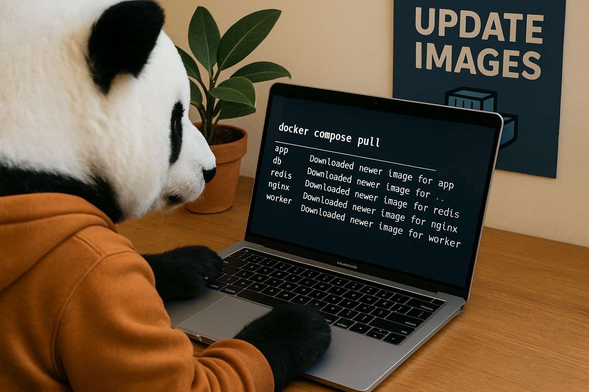

<div align="center">
<h1>Deities</h1>
<h6>Kubernetes Image Update Controller</h6>

</div>

## Introduction

Deities is a Go application that monitors Docker registries for image updates and automatically triggers rollouts of Kubernetes deployments when new images are pushed. It uses image digests (not tags) to detect updates, ensuring accurate change detection even when tags are reused.

## Features

- 🔍 **Digest-based monitoring** - Uses image digests instead of tags for accurate update detection
- 🔄 **Automatic rollouts** - Triggers Kubernetes deployment rollouts when new images are detected
- 🐳 **Multi-registry support** - Works with Docker Hub, GCR, ECR, and other Docker registries
- 🔐 **Authentication support** - Supports private registries with username/password authentication
- ⏱️ **Configurable intervals** - Set custom check intervals for monitoring
- 📊 **Colorful logging** - Beautiful, structured logging with pterm integration
- 🎨 **Pretty output** - Colorful ASCII logo and well-formatted logs
- 🏗️ **Clean architecture** - Built with Uber's fx dependency injection framework
- 🔧 **Environment variables** - Override configuration via environment variables

## Requirements

- Go 1.25 or later
- Access to Kubernetes cluster (in-cluster or via kubeconfig)
- Deployments must have `imagePullPolicy: Always`

## Installation

### Build from source

```bash
git clone https://github.com/parham/deities.git
cd deities
go mod download
go build -o deities .
```

### Install dependencies

```bash
go mod download
```

## Configuration

Create a `config.toml` file with your repositories and deployments:

```toml
# Logger configuration
[logger]
level = "info"  # Options: debug, info, warn, error

# Kubernetes configuration
[k8s]
kubeconfig = "$HOME/.kube/config"  # Path to kubeconfig (empty for in-cluster config)

# Controller configuration
[controller]
check_interval = "5m"  # How often to check for image updates

# Registries configuration (define registry addresses and authentication)
[[controller.registries]]
name = "https://registry-1.docker.io"  # Docker Hub

[[controller.registries]]
name = "https://gcr.io"
[controller.registries.auth]
username = "_json_key"
password = "${GCR_JSON_KEY}"

# Images to monitor (each image references a registry)
[[controller.images]]
name = "nginx"
registry = "https://registry-1.docker.io"
tag = "latest"

[[controller.images]]
name = "nginx"
registry = "https://registry-1.docker.io"
tag = "stable"

[[controller.images]]
name = "myorg/myapp"
registry = "https://registry-1.docker.io"
tag = "stable"

# Deployments to manage
[[controller.deployments]]
name = "nginx-deployment"
namespace = "default"
container = "nginx"
image = "nginx"

[[controller.deployments]]
name = "myapp-deployment"
namespace = "production"
container = "app"
image = "myorg/myapp"
```

### Configuration Options

#### Logger Settings (`[logger]`)

- `level`: Log level (options: "debug", "info", "warn", "error")

#### Kubernetes Settings (`[k8s]`)

- `kubeconfig`: Path to kubeconfig file (leave empty for in-cluster config)

#### Controller Settings (`[controller]`)

- `check_interval`: How often to check for updates (e.g., "5m", "1h", "30s")

#### Registries (`[[controller.registries]]`)

- `name`: Registry address (e.g., "https://registry-1.docker.io" for Docker Hub)
- `auth`: Optional authentication credentials
  - `username`: Registry username
  - `password`: Registry password

#### Images (`[[controller.images]]`)

- `name`: Image name (for Docker Hub, omit "library/" prefix for official images)
- `registry`: Reference to a registry defined in `[[controller.registries]]`
- `tag`: Image tag to monitor (e.g., "latest", "stable")

#### Deployments (`[[controller.deployments]]`)

- `name`: Deployment name in Kubernetes
- `namespace`: Kubernetes namespace
- `container`: Container name within the deployment
- `image`: Image prefix to match against images

### Environment Variables

Configuration can also be set via environment variables with the `deities_` prefix. Use double underscores (`__`) to represent nested fields:

```bash
# Examples:
export deities_logger__level=debug
export deities_k8s__kubeconfig=/path/to/kubeconfig
export deities_controller__check_interval=10m
```

Environment variables override values from `config.toml`.

## Usage

### Run locally

```bash
./deities
```

### Run in Kubernetes

Create a deployment for Deities:

```yaml
apiVersion: v1
kind: ServiceAccount
metadata:
  name: deities
  namespace: default
---
apiVersion: rbac.authorization.k8s.io/v1
kind: ClusterRole
metadata:
  name: deities
rules:
  - apiGroups: ["apps"]
    resources: ["deployments"]
    verbs: ["get", "list", "update", "patch"]
---
apiVersion: rbac.authorization.k8s.io/v1
kind: ClusterRoleBinding
metadata:
  name: deities
roleRef:
  apiGroup: rbac.authorization.k8s.io
  kind: ClusterRole
  name: deities
subjects:
  - kind: ServiceAccount
    name: deities
    namespace: default
---
apiVersion: v1
kind: ConfigMap
metadata:
  name: deities-config
  namespace: default
data:
  config.toml: |
    [logger]
    level = "info"

    [k8s]
    kubeconfig = ""

    [controller]
    check_interval = "5m"

    [[controller.registries]]
    name = "https://registry-1.docker.io"

    [[controller.images]]
    name = "nginx"
    registry = "https://registry-1.docker.io"
    tag = "latest"

    [[controller.deployments]]
    name = "nginx-deployment"
    namespace = "default"
    container = "nginx"
    image = "nginx"
---
apiVersion: apps/v1
kind: Deployment
metadata:
  name: deities
  namespace: default
spec:
  replicas: 1
  selector:
    matchLabels:
      app: deities
  template:
    metadata:
      labels:
        app: deities
    spec:
      serviceAccountName: deities
      containers:
        - name: deities
          image: deities:latest
          imagePullPolicy: Always
          args:
            - "-config"
            - "/etc/deities/config.toml"
          volumeMounts:
            - name: config
              mountPath: /etc/deities
      volumes:
        - name: config
          configMap:
            name: deities-config
```

## Important Notes

### ImagePullPolicy Requirement

All deployments managed by Deities **must** have `imagePullPolicy: Always`. This ensures that when the deployment is updated with a new digest, Kubernetes will pull the latest image from the registry.

```yaml
spec:
  containers:
    - name: myapp
      image: myapp:latest
      imagePullPolicy: Always # REQUIRED
```

Without `imagePullPolicy: Always`, the deployment will fail to update, and Deities will return an error.

### Digest-based Updates

Deities uses image digests (SHA256 hashes) rather than tags to detect updates. This means:

- Even if a tag like `latest` is reused, Deities will detect the new image
- Updates are based on actual image content changes, not tag changes
- Deployments are updated with digest references (e.g., `nginx@sha256:abc123...`)

## How It Works

1. **Initial Scan**: On startup, Deities fetches the current digest for each configured repository
2. **Periodic Checks**: At the configured interval, it queries each registry for the latest digest
3. **Change Detection**: If a digest has changed, it indicates a new image was pushed
4. **Deployment Update**: Deities updates matching Kubernetes deployments with the new image digest
5. **Automatic Rollout**: Kubernetes automatically rolls out the updated deployment

## Troubleshooting

### Authentication Errors

If you see authentication errors:

- Verify your username and password are correct
- For Docker Hub, you may need to use an access token instead of your password
- For private registries, ensure you're using the correct authentication method

### Deployment Not Updating

If deployments aren't updating:

- Check that `imagePullPolicy: Always` is set
- Verify the image prefix in the deployment config matches the repository
- Check logs for errors

### Permission Errors

If you see Kubernetes permission errors:

- Ensure the ServiceAccount has appropriate RBAC permissions
- Verify the ClusterRole includes `get`, `list`, `update`, and `patch` on deployments

## Development

### Project Structure

```
deities/
├── main.go                      # Application entry point with fx setup
├── internal/
│   ├── config/
│   │   ├── config.go            # Centralized configuration with fx.Out
│   │   └── default.go           # Default configuration values
│   ├── logger/
│   │   └── logger.go            # Logger module with pterm integration
│   ├── logo/
│   │   └── logo.go              # ASCII logo with pterm
│   ├── registry/
│   │   └── client.go            # Docker registry client
│   ├── k8s/
│   │   └── client.go            # Kubernetes client
│   └── controller/
│       └── controller.go        # Main controller logic
├── config.toml                  # Example configuration
└── README.md
```

Each module follows the **dependency injection pattern** using Uber's fx framework:

- Each module provides a `Provide()` function for fx dependency injection
- Configuration is modular - each module defines its own `Config` struct
- All modules are wired together in `main.go` using fx

### Building

Using just (recommended):

```bash
just build
```

Or directly with Go:

```bash
go build -o deities .
```

### Available Commands

This project uses [just](https://github.com/casey/just) for task automation. Available commands:

```bash
just build          # Build the application
just run            # Build and run with config.toml
just test           # Run tests
just deps           # Install dependencies
just docker-build   # Build Docker image
just docker-push    # Build and push Docker image
just clean          # Clean build artifacts
just fmt            # Format code
just lint           # Run linter
just build-all      # Build for multiple platforms
```

### Testing

```bash
just test
# or
go test ./...
```
